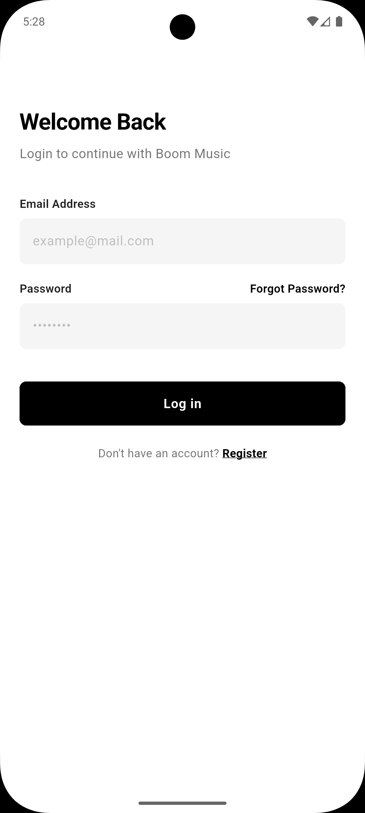
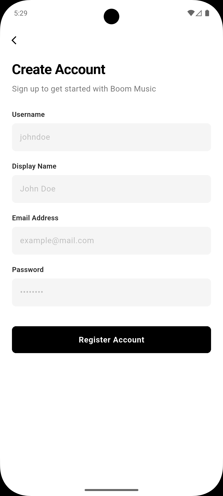

# Flutter + Laravel Authentication Flow System 🔐📱

A premium, minimalist, and highly secure **Authentication Flow** built with Flutter using **Provider** for state management and a **Laravel API** as the backend. The user interface is inspired by the modern **Uber UI style**, featuring a clean black-and-white aesthetic, sleek input containers, and a smooth user experience.

<p align="center">
  
  
  
  
  
</p>

<p align="center">
  <i>Sleek Black & White Architecture with Intelligent Error Delivery</i>
</p>

---

## ✨ Features

| Feature | Description |
|---|---|
| 🎨 **Uber-Style UI** | Pure white backgrounds, bold typography, full-width solid black action buttons |
| ✅ **Client-Side Validation** | Email, username & passwords validated locally before API requests |
| ⚙️ **State Management** | Powered by `Provider` for clean architecture and separation of concerns |
| 📱 **Device-Aware Registration** | Automatically captures device info during signup via `ApiService` |
| 🔐 **Secure Login** | Auto-trims inputs, issues & stores Sanctum Bearer Tokens via `SharedPreferences` |
| 📧 **OTP Reset Flow** | Full forgot-password flow with 6-digit OTP verification |

---

## 🛠️ Tech Stack

| Layer | Technology |
|---|---|
| **Frontend** | Flutter & Dart (Provider, HTTP, SharedPreferences) |
| **Backend** | Laravel (PHP ≥ 8.1) |
| **Database** | MySQL / PostgreSQL |
| **Auth** | Laravel Sanctum (API Bearer Tokens) |

---

## 🚀 Setup & Installation

### 💻 1. Backend — Laravel API

**Prerequisites:** PHP ≥ 8.1, Composer, MySQL

```bash
# 1. Navigate to backend directory
cd boom-music-backend

# 2. Install dependencies
composer install

# 3. Set up environment
cp .env.example .env
php artisan key:generate
```

Configure your `.env` database settings:

```env
DB_CONNECTION=mysql
DB_HOST=127.0.0.1
DB_PORT=3306
DB_DATABASE=boom_music_db
DB_USERNAME=root
DB_PASSWORD=your_password
```

```bash
# 4. Run migrations
php artisan migrate

# 5. Start the server
php artisan serve --host=0.0.0.0 --port=8000
```

---

### 📱 2. Frontend — Flutter App

**Prerequisites:** [Flutter SDK](https://docs.flutter.dev/get-started/install) (Latest Stable), Android Studio / VS Code / Xcode

```bash
# 1. Clone the repository
git clone https://github.com/dinidumaleezha/flutter-laravel-auth-flow.git
cd uber-auth-flutter

# 2. Install dependencies
flutter pub get
```

**3. Configure the API endpoint**

Open `lib/services/api_service.dart` and update the base URL:

```dart
static const String baseUrl = "http://YOUR_LOCAL_IP_ADDRESS:8000/api";
```

> **⚠️ Android Emulator:** Use `http://10.0.2.2:8000/api` to reference your local machine's localhost.

```bash
# 4. Run the app
flutter run
```

---

## 📂 Project Structure

```
lib/
│
├── models/           # Data models (User, DeviceInfo, etc.)
├── providers/        # AuthProvider — UI state, loading states & tokens
├── services/         # ApiService (HTTP wrappers) & AuthService (API calls)
└── screens/
    └── auth/         # Premium Uber-Style Authentication Screens
        ├── login_screen.dart
        ├── register_screen.dart
        ├── forgot_password_screen.dart
        ├── otp_verify_screen.dart
        └── reset_password_screen.dart
```

---

## 🛡️ API Endpoints

All endpoints are mapped in `routes/api.php` and return standard JSON responses.

| Method | Endpoint | Description |
|---|---|---|
| `POST` | `/api/register` | Creates a new account with device signature tracking |
| `POST` | `/api/login` | Authenticates credentials and issues a Sanctum Bearer Token |
| `POST` | `/api/password/forgot` | Validates email and dispatches a secure 6-digit OTP |
| `POST` | `/api/password/verify-otp` | Validates OTP authenticity and expiration |
| `POST` | `/api/password/reset` | Securely updates the user's password |

---

## 🤝 Contributing

Contributions are welcome and greatly appreciated!

1. **Fork** the project
2. Create your feature branch: `git checkout -b feature/AmazingFeature`
3. Commit your changes: `git commit -m 'Add some AmazingFeature'`
4. Push to the branch: `git push origin feature/AmazingFeature`
5. Open a **Pull Request**

---

## 📝 License

Distributed under the **MIT License**. See [`LICENSE`](LICENSE) for more information.

---

<p align="center">Developed with ❤️ by <a href="https://github.com/YOUR_GITHUB_USERNAME">Dinidu Maleesha</a></p>
